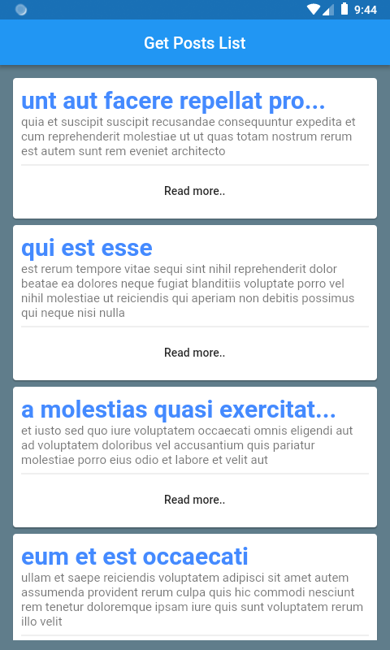
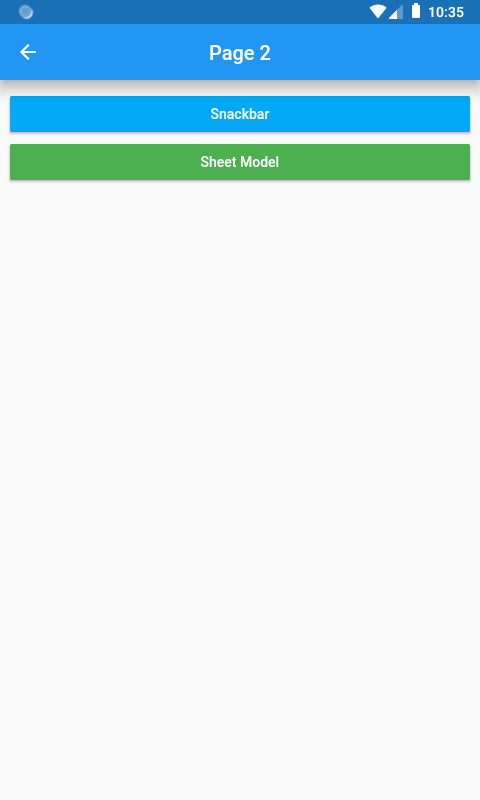
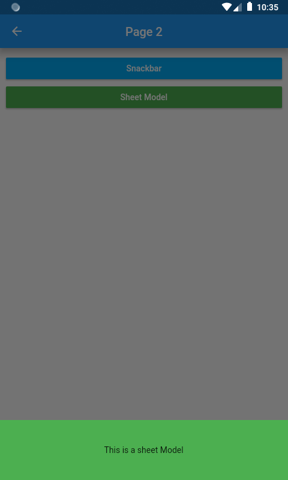
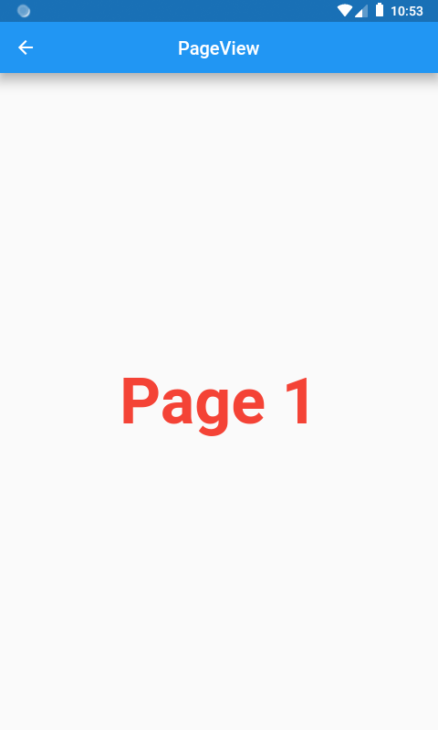
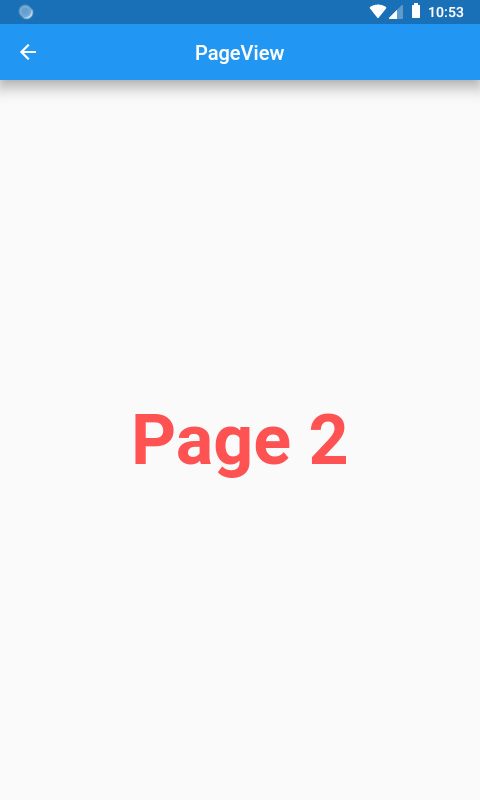
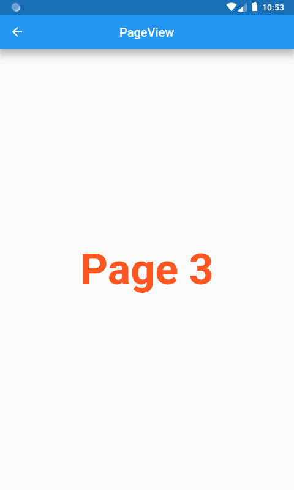

# flutterjsonapp

A new Flutter application which get the date from fake api.

## Getting Started

This project is a starting point for a Flutter application.

A few resources to get you started if this is your first Flutter project:

## Get the list of post :

<table>
    <tr>
        <td style="padding:10px">
            
        </td>
        <td style="padding:10px">
            
        </td>
    </tr>
</table>

## Add snackbar and a SheetModal Button :

<table>
    <tr>
        <td style="padding:10px">
            
        </td>
        <td style="padding:10px">
            
        </td>
    </tr>
</table>

## Add PageView :

<table>
    <tr>
        <td style="padding:10px">
            
        </td>
        <td style="padding:10px">
            
        </td>
        <td style="padding:10px">
            
        </td>
    </tr>
</table>